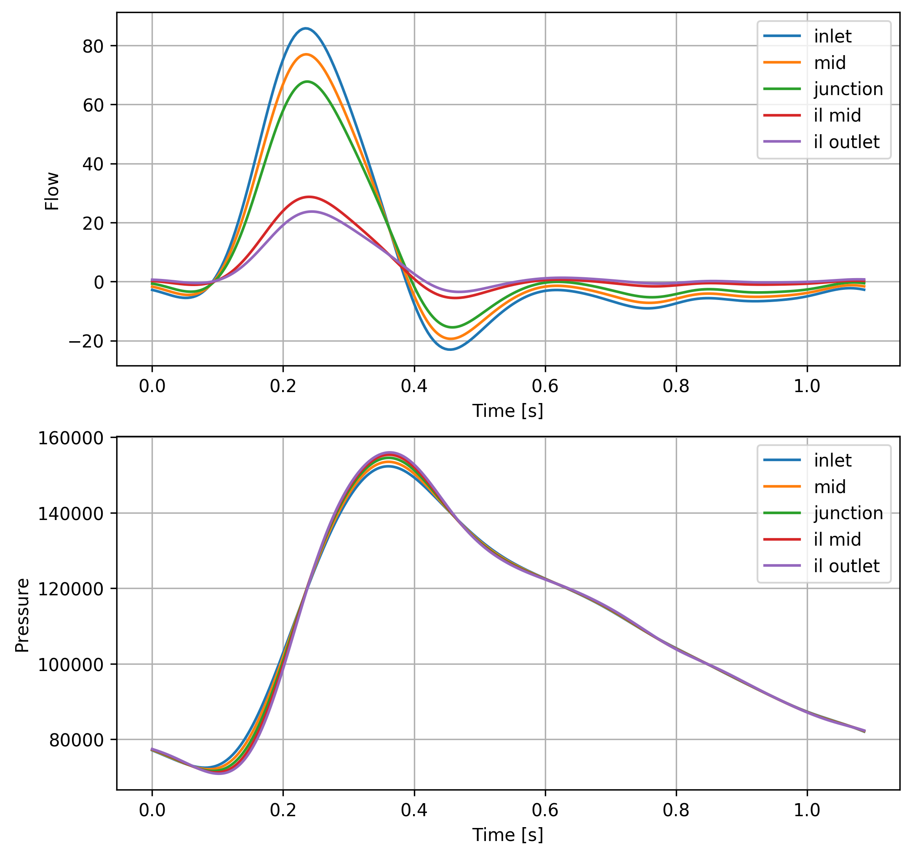

Bifurcation with RCR boundary conditions
========================================

This example is documented in the test case :code:`test/bifurcation_RCR.in`. The geometry and images for this example are taken from [1]_. The geometry consists of a symmetric bifurcation with RCR boundary conditions. All three branches have a constant diameter, the inflow is pulsatile. The parameters are taken from Table III [1]_).

The test case is only run for 2 cycles. To reach a periodic state, at least 10 cycles are required:

The results are similar to the ones in Figure 11 [1]_.

.. literalinclude:: ../../../test/bifurcation_RCR.in

References
----------

.. [1] N. Xiao, J. Alastruey, and C. Alberto Figueroa (2014), A systematic comparison between 1‐D and 3‐D hemodynamics in compliant arterial models. Int. J. Numer. Meth. Biomed. Engng., 30: 204-231. doi:10.1002/cnm.2598
