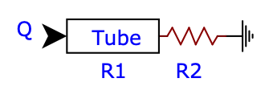
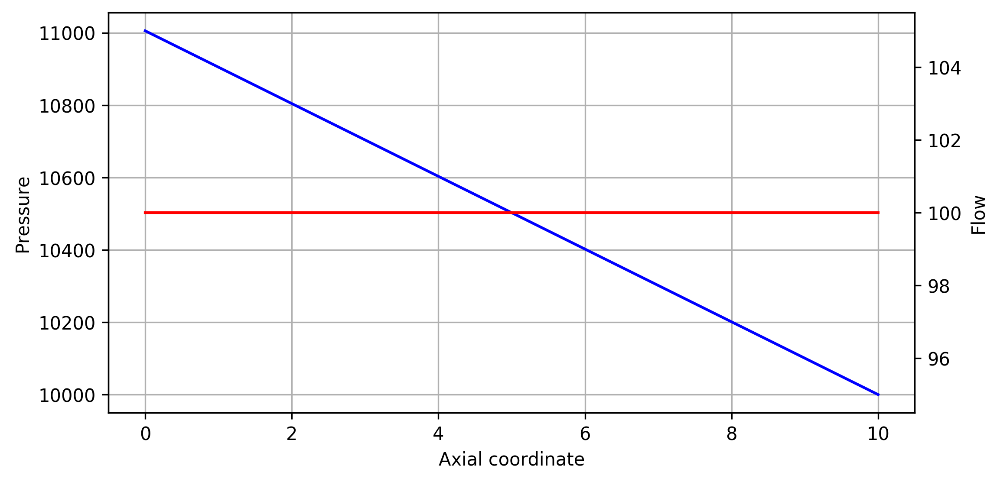

Tube with resistance boundary condition
=======================================

This example is documented in the test case :code:`test/tuber_r.in`. It consists of a tube (length :math:`L=10`, constant cross-section :math:`A=1`), constant inflow boundary condition (flow :math:`Q=100`), resistance outlet boundary condition (resistance :math:`R_2=100`), Poiseuille flow (profile exponent = 2.0), and quasi-rigid wall (i.e. wall stiffness :math:`\to\infty`). The simulation runs for 1000 time steps to achieve a steady state.

.. literalinclude:: ../../../test/tube_r.in

The tube resistance can be analytically calculated as

.. math::
  R_1 = \frac{8\mu l \pi}{A^2} \approx 10.05309649,

with viscosity :math:`\mu=0.04`. The pressures at inlet and outlet :math:`P_\text{in}` and :math:`P_\text{out}`, respectively, can then be calculated as

.. math::
  P_\text{in} &= Q \cdot (R_1 + R_2) \approx 11005.309649 \\
  P_\text{out} &= Q \cdot R_2 = 10000.0

The following plot shows that pressure (blue) drops linearly and flow (red) is constant along the tube.

