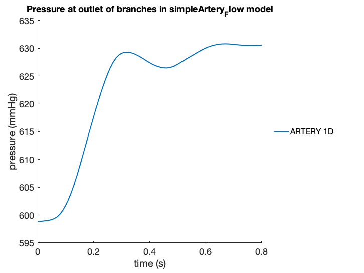
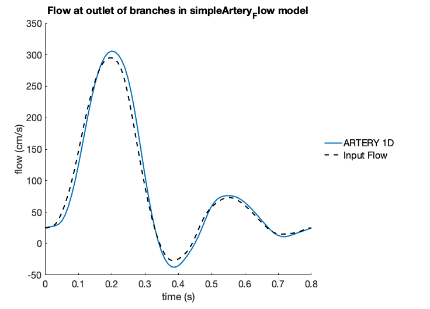
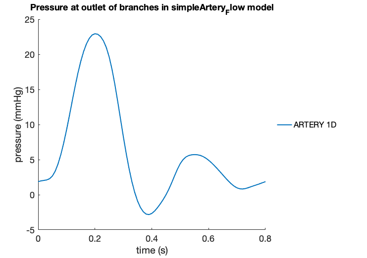
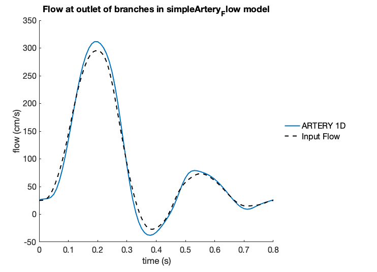
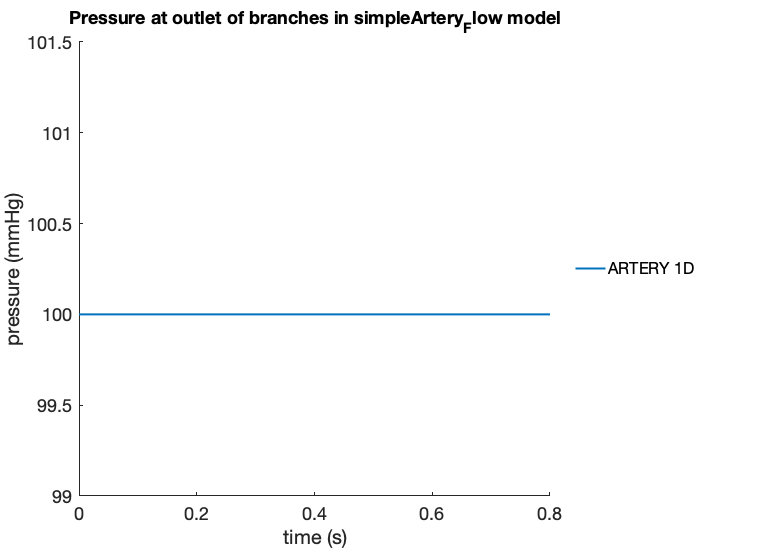

Simple Artery
=============

Outlet Flow
^^^^^^^^^^^

A simple arterial segment is considered in the first tutorial, subject to a variety of outflow boundary conditions. The input file for the first model is reported here below. ::

  MODEL simpleArtery_Flow_

  NODE 0 0.0 0.0 0.0
  NODE 1 0.0 0.0 -20.0

  # NO JOINTS IN THIS MODEL

  SEGMENT ARTERY 0 20.0 50 0 1 2.0 2.0 14.0 MAT1 NONE 0.0 0 0 FLOW OUTLETDATA

  DATATABLE INLETDATA LIST
  0.0 24.9485671447
  0.00401706131058 25.038543576
  0.00804158927788 25.1253750951
  0.0120586505885 25.3133340807
  0.0160831785558 25.7172792237
  0.0201002398663 26.4516350474
  0.0241173011769 27.6195531882
  0.0281418291442 29.3038021034
  0.0321588904548 31.5606599331
  0.0361834184221 34.4176116259
  0.0402004797327 37.8750455157
  0.0442175410433 41.9115017555
  0.0482420690106 46.4914673291
  0.0522591303212 51.5743145829
  0.0562836582885 57.1228256834
  0.060300719599 63.1098514231
  0.0643252475663 69.5220015042
  0.0683423088769 76.3597981496
  0.0723593701875 83.6343477651
  0.0763838981548 91.3611943552
  0.0804009594654 99.5525021976
  0.0844254874327 108.208997219
  0.0884425487433 117.313126431
  0.0924596100539 126.824666809
  0.0964841380211 136.679580202
  0.100501199332 146.792340186
  0.104525727299 157.061354108
  0.10854278861 167.376580507
  0.11255984992 177.628083291
  0.116584377887 187.714136939
  0.120601439198 197.547616689
  0.124625967165 207.059750772
  0.128643028476 216.200813465
  0.132660089787 224.937897126
  0.136684617754 233.250429224
  0.140701679064 241.12448159
  0.144726207032 248.547101058
  0.148743268342 255.501829545
  0.152760329653 261.966302945
  0.15678485762 267.91235955
  0.160801918931 273.308561533
  0.164826446898 278.124512738
  0.168843508209 282.335962851
  0.172860569519 285.929487871
  0.176885097487 288.90557465
  0.180902158797 291.279208303
  0.184926686764 293.077520075
  0.188943748075 294.334618627
  0.192968276042 295.084290955
  0.196985337353 295.351725893
  0.201002398663 295.145680584
  0.205026926631 294.452540193
  0.209043987941 293.233485586
  0.213068515909 291.425532597
  0.217085577219 288.946601564
  0.22110263853 285.70412707
  0.225127166497 281.606131294
  0.229144227808 276.573264115
  0.233168755775 270.550125543
  0.237185817086 263.51427286
  0.241202878396 255.481650163
  0.245227406363 246.507714017
  0.249244467674 236.684172337
  0.253268995641 226.131893546
  0.257286056952 214.991082946
  0.261303118263 203.410169094
  0.26532764623 191.534949707
  0.26934470754 179.499405635
  0.273369235508 167.41923233
  0.277386296818 155.388639562
  0.281403358129 143.480410496
  0.285427886096 131.748704658
  0.289444947407 120.233702756
  0.293469475374 108.966999282
  0.297486536685 97.9766585376
  0.301503597995 87.2910578797
  0.305528125962 76.9409855029
  0.309545187273 66.9598753462
  0.31356971524 57.3824574617
  0.317586776551 48.2424082888
  0.321611304518 39.569743891
  0.325628365829 31.3886895826
  0.329645427139 23.7165911301
  0.333669955107 16.5641438274
  0.337687016417 9.93688018295
  0.341711544385 3.83753834884
  0.345728605695 -1.73129722655
  0.349745667006 -6.76498144367
  0.353770194973 -11.2556542907
  0.357787256284 -15.1925670479
  0.361811784251 -18.5639944198
  0.365828845562 -21.3604787071
  0.369845906872 -23.5788280531
  0.373870434839 -25.2260660795
  0.37788749615 -26.3224530944
  0.381912024117 -26.9027993353
  0.385929085428 -27.015546634
  0.389946146738 -26.719474801
  0.393970674706 -26.0783193949
  0.397987736016 -25.1539952306
  0.402012263984 -23.9994270173
  0.406029325294 -22.6521354593
  0.410046386605 -21.1296839164
  0.414070914572 -19.4278520119
  0.418087975883 -17.5220123013
  0.42211250385 -15.3716976869
  0.426129565161 -12.9278448545
  0.430146626471 -10.1417648421
  0.434171154438 -6.97459768401
  0.438188215749 -3.40590409029
  0.442212743716 0.559852321251
  0.446229805027 4.88988390883
  0.450254332994 9.52323419211
  0.454271394305 14.3745124875
  0.458288455615 19.3407053071
  0.462312983583 24.3101412797
  0.466330044893 29.1724063508
  0.470354572861 33.8279151858
  0.474371634171 38.1959388674
  0.478388695482 42.2201524963
  0.482413223449 45.871148806
  0.48643028476 49.1458023291
  0.490454812727 52.0637949468
  0.494471874038 54.6619653254
  0.498488935348 56.9873751098
  0.502513463315 59.0900727083
  0.506530524626 61.0164764312
  0.510555052593 62.8041192052
  0.514572113904 64.4782349571
  0.518589175214 66.0503675931
  0.522613703182 67.5188969255
  0.526630764492 68.8711433057
  0.53065529246 70.0865579991
  0.53467235377 71.1404415244
  0.538689415081 72.0076559733
  0.542713943048 72.6658851088
  0.546731004359 73.0981315905
  0.550755532326 73.2942889218
  0.554772593637 73.2517649691
  0.558789654947 72.9752495544
  0.562814182914 72.4757923237
  0.566831244225 71.7693993197
  0.570855772192 70.8753586268
  0.574872833503 69.8144948133
  0.57889736147 68.6075179102
  0.582914422781 67.2736004464
  0.586931484091 65.8292837429
  0.590956012059 64.2877808751
  0.594973073369 62.6587139871
  0.598997601337 60.9482898474
  0.603014662647 59.1598805908
  0.607031723958 57.2949382563
  0.611056251925 55.3541315489
  0.615073313236 53.3385658404
  0.619097841203 51.2509277089
  0.623114902513 49.0964028105
  0.627131963824 46.8832462501
  0.631156491791 44.6229340634
  0.635173553102 42.3298944201
  0.639198081069 40.0208905863
  0.64321514238 37.7141850892
  0.64723220369 35.4286569387
  0.651256731658 33.1830441259
  0.655273792968 30.9954505668
  0.659298320936 28.8831861021
  0.663315382246 26.8629219606
  0.667332443557 24.9510496484
  0.671356971524 23.1640581717
  0.675374032835 21.5187111666
  0.679398560802 20.0318203252
  0.683415622113 18.719482153
  0.687432683423 17.5957616712
  0.69145721139 16.6709456543
  0.695474272701 15.9496274427
  0.699498800668 15.4289872173
  0.703515861979 15.0976749611
  0.707540389946 14.9356617551
  0.711557451257 14.9153075579
  0.715574512567 15.0036963016
  0.719599040535 15.1660610822
  0.723616101845 15.3698862953
  0.727640629812 15.5890888464
  0.731657691123 15.8075811185
  0.735674752434 16.0215392172
  0.739699280401 16.2398440817
  0.743716341712 16.4824250012
  0.747740869679 16.7765754424
  0.751757930989 17.1516703569
  0.7557749923 17.6330420974
  0.759799520267 18.2359914278
  0.763816581578 18.9609858486
  0.767841109545 19.7909909825
  0.771858170856 20.6916127038
  0.775875232166 21.6143095508
  0.779899760134 22.502454957
  0.783916821444 23.2995386527
  0.787941349412 23.9584014928
  0.791958410722 24.4501547304
  0.795975472033 24.7714012308
  0.8 24.9485671447
  ENDDATATABLE

  DATATABLE OUTLETDATA LIST
  0.0 20.0
  10.0 20.0
  ENDDATATABLE

  MATERIAL MAT1 OLUFSEN 1.06 0.04 113324.0 1.0 2.0e7 -22.5267 8.65e5

  SOLVEROPTIONS 0.01 1 400 2 INLETDATA FLOW 1.0e-4 1 1 

  OUTPUT TEXT

Results
"""""""
The graphs here below illustrate the results:

.. image:: Images/Ex01-plottingExample_01.png
   :width: 600
   :alt: Flows in model

Outlet Resistance
^^^^^^^^^^^^^^^^^

In the second example, application of an outlet resistance, results in the following input file ::

  MODEL simpleArtery_Res_

  NODE 0 0.0 0.0 0.0
  NODE 1 0.0 0.0 -20.0

  # NO JOINTS IN THIS MODEL

  SEGMENT ARTERY 0 20.0 50 0 1 2.0 2.0 0.0 MAT1 NONE 0.0 0 0 RESISTANCE RESTABLE

  DATATABLE RESTABLE LIST
  0.0 100.0
  ENDDATATABLE

  DATATABLE INLETDATA LIST
  0.0 24.9485671447
  0.00401706131058 25.038543576
  0.00804158927788 25.1253750951
  0.0120586505885 25.3133340807
  0.0160831785558 25.7172792237
  0.0201002398663 26.4516350474
  0.0241173011769 27.6195531882
  0.0281418291442 29.3038021034
  0.0321588904548 31.5606599331
  0.0361834184221 34.4176116259
  0.0402004797327 37.8750455157
  0.0442175410433 41.9115017555
  0.0482420690106 46.4914673291
  0.0522591303212 51.5743145829
  0.0562836582885 57.1228256834
  0.060300719599 63.1098514231
  0.0643252475663 69.5220015042
  0.0683423088769 76.3597981496
  0.0723593701875 83.6343477651
  0.0763838981548 91.3611943552
  0.0804009594654 99.5525021976
  0.0844254874327 108.208997219
  0.0884425487433 117.313126431
  0.0924596100539 126.824666809
  0.0964841380211 136.679580202
  0.100501199332 146.792340186
  0.104525727299 157.061354108
  0.10854278861 167.376580507
  0.11255984992 177.628083291
  0.116584377887 187.714136939
  0.120601439198 197.547616689
  0.124625967165 207.059750772
  0.128643028476 216.200813465
  0.132660089787 224.937897126
  0.136684617754 233.250429224
  0.140701679064 241.12448159
  0.144726207032 248.547101058
  0.148743268342 255.501829545
  0.152760329653 261.966302945
  0.15678485762 267.91235955
  0.160801918931 273.308561533
  0.164826446898 278.124512738
  0.168843508209 282.335962851
  0.172860569519 285.929487871
  0.176885097487 288.90557465
  0.180902158797 291.279208303
  0.184926686764 293.077520075
  0.188943748075 294.334618627
  0.192968276042 295.084290955
  0.196985337353 295.351725893
  0.201002398663 295.145680584
  0.205026926631 294.452540193
  0.209043987941 293.233485586
  0.213068515909 291.425532597
  0.217085577219 288.946601564
  0.22110263853 285.70412707
  0.225127166497 281.606131294
  0.229144227808 276.573264115
  0.233168755775 270.550125543
  0.237185817086 263.51427286
  0.241202878396 255.481650163
  0.245227406363 246.507714017
  0.249244467674 236.684172337
  0.253268995641 226.131893546
  0.257286056952 214.991082946
  0.261303118263 203.410169094
  0.26532764623 191.534949707
  0.26934470754 179.499405635
  0.273369235508 167.41923233
  0.277386296818 155.388639562
  0.281403358129 143.480410496
  0.285427886096 131.748704658
  0.289444947407 120.233702756
  0.293469475374 108.966999282
  0.297486536685 97.9766585376
  0.301503597995 87.2910578797
  0.305528125962 76.9409855029
  0.309545187273 66.9598753462
  0.31356971524 57.3824574617
  0.317586776551 48.2424082888
  0.321611304518 39.569743891
  0.325628365829 31.3886895826
  0.329645427139 23.7165911301
  0.333669955107 16.5641438274
  0.337687016417 9.93688018295
  0.341711544385 3.83753834884
  0.345728605695 -1.73129722655
  0.349745667006 -6.76498144367
  0.353770194973 -11.2556542907
  0.357787256284 -15.1925670479
  0.361811784251 -18.5639944198
  0.365828845562 -21.3604787071
  0.369845906872 -23.5788280531
  0.373870434839 -25.2260660795
  0.37788749615 -26.3224530944
  0.381912024117 -26.9027993353
  0.385929085428 -27.015546634
  0.389946146738 -26.719474801
  0.393970674706 -26.0783193949
  0.397987736016 -25.1539952306
  0.402012263984 -23.9994270173
  0.406029325294 -22.6521354593
  0.410046386605 -21.1296839164
  0.414070914572 -19.4278520119
  0.418087975883 -17.5220123013
  0.42211250385 -15.3716976869
  0.426129565161 -12.9278448545
  0.430146626471 -10.1417648421
  0.434171154438 -6.97459768401
  0.438188215749 -3.40590409029
  0.442212743716 0.559852321251
  0.446229805027 4.88988390883
  0.450254332994 9.52323419211
  0.454271394305 14.3745124875
  0.458288455615 19.3407053071
  0.462312983583 24.3101412797
  0.466330044893 29.1724063508
  0.470354572861 33.8279151858
  0.474371634171 38.1959388674
  0.478388695482 42.2201524963
  0.482413223449 45.871148806
  0.48643028476 49.1458023291
  0.490454812727 52.0637949468
  0.494471874038 54.6619653254
  0.498488935348 56.9873751098
  0.502513463315 59.0900727083
  0.506530524626 61.0164764312
  0.510555052593 62.8041192052
  0.514572113904 64.4782349571
  0.518589175214 66.0503675931
  0.522613703182 67.5188969255
  0.526630764492 68.8711433057
  0.53065529246 70.0865579991
  0.53467235377 71.1404415244
  0.538689415081 72.0076559733
  0.542713943048 72.6658851088
  0.546731004359 73.0981315905
  0.550755532326 73.2942889218
  0.554772593637 73.2517649691
  0.558789654947 72.9752495544
  0.562814182914 72.4757923237
  0.566831244225 71.7693993197
  0.570855772192 70.8753586268
  0.574872833503 69.8144948133
  0.57889736147 68.6075179102
  0.582914422781 67.2736004464
  0.586931484091 65.8292837429
  0.590956012059 64.2877808751
  0.594973073369 62.6587139871
  0.598997601337 60.9482898474
  0.603014662647 59.1598805908
  0.607031723958 57.2949382563
  0.611056251925 55.3541315489
  0.615073313236 53.3385658404
  0.619097841203 51.2509277089
  0.623114902513 49.0964028105
  0.627131963824 46.8832462501
  0.631156491791 44.6229340634
  0.635173553102 42.3298944201
  0.639198081069 40.0208905863
  0.64321514238 37.7141850892
  0.64723220369 35.4286569387
  0.651256731658 33.1830441259
  0.655273792968 30.9954505668
  0.659298320936 28.8831861021
  0.663315382246 26.8629219606
  0.667332443557 24.9510496484
  0.671356971524 23.1640581717
  0.675374032835 21.5187111666
  0.679398560802 20.0318203252
  0.683415622113 18.719482153
  0.687432683423 17.5957616712
  0.69145721139 16.6709456543
  0.695474272701 15.9496274427
  0.699498800668 15.4289872173
  0.703515861979 15.0976749611
  0.707540389946 14.9356617551
  0.711557451257 14.9153075579
  0.715574512567 15.0036963016
  0.719599040535 15.1660610822
  0.723616101845 15.3698862953
  0.727640629812 15.5890888464
  0.731657691123 15.8075811185
  0.735674752434 16.0215392172
  0.739699280401 16.2398440817
  0.743716341712 16.4824250012
  0.747740869679 16.7765754424
  0.751757930989 17.1516703569
  0.7557749923 17.6330420974
  0.759799520267 18.2359914278
  0.763816581578 18.9609858486
  0.767841109545 19.7909909825
  0.771858170856 20.6916127038
  0.775875232166 21.6143095508
  0.779899760134 22.502454957
  0.783916821444 23.2995386527
  0.787941349412 23.9584014928
  0.791958410722 24.4501547304
  0.795975472033 24.7714012308
  0.8 24.9485671447
  ENDDATATABLE

  MATERIAL MAT1 OLUFSEN 1.06 0.04 113324.0 1.0 2.0e7 -22.5267 8.65e5

  SOLVEROPTIONS 0.01 1 400 2 INLETDATA FLOW 1.0e-4 1 1 

  OUTPUT TEXT

Results
"""""""

The graphs here below illustrate the results:

Outlet Pressure
^^^^^^^^^^^^^^^

In the fourth example, a constant outlet pressure is applied to the arterial segment. A data table is thus created with a fictious time. The new input file looks like ::

  MODEL simpleArtery_Press_

  NODE 0 0.0 0.0 0.0
  NODE 1 0.0 0.0 -20.0

  # NO JOINTS IN THIS MODEL

  SEGMENT ARTERY 0 20.0 50 0 1 2.0 2.0 14.0 MAT1 NONE 0.0 0 0 PRESSURE PRESSTABLE

  DATATABLE PRESSTABLE LIST
  0.0 100.0
  ENDDATATABLE

  DATATABLE INLETDATA LIST
  0.0 24.9485671447
  0.00401706131058 25.038543576
  0.00804158927788 25.1253750951
  0.0120586505885 25.3133340807
  0.0160831785558 25.7172792237
  0.0201002398663 26.4516350474
  0.0241173011769 27.6195531882
  0.0281418291442 29.3038021034
  0.0321588904548 31.5606599331
  0.0361834184221 34.4176116259
  0.0402004797327 37.8750455157
  0.0442175410433 41.9115017555
  0.0482420690106 46.4914673291
  0.0522591303212 51.5743145829
  0.0562836582885 57.1228256834
  0.060300719599 63.1098514231
  0.0643252475663 69.5220015042
  0.0683423088769 76.3597981496
  0.0723593701875 83.6343477651
  0.0763838981548 91.3611943552
  0.0804009594654 99.5525021976
  0.0844254874327 108.208997219
  0.0884425487433 117.313126431
  0.0924596100539 126.824666809
  0.0964841380211 136.679580202
  0.100501199332 146.792340186
  0.104525727299 157.061354108
  0.10854278861 167.376580507
  0.11255984992 177.628083291
  0.116584377887 187.714136939
  0.120601439198 197.547616689
  0.124625967165 207.059750772
  0.128643028476 216.200813465
  0.132660089787 224.937897126
  0.136684617754 233.250429224
  0.140701679064 241.12448159
  0.144726207032 248.547101058
  0.148743268342 255.501829545
  0.152760329653 261.966302945
  0.15678485762 267.91235955
  0.160801918931 273.308561533
  0.164826446898 278.124512738
  0.168843508209 282.335962851
  0.172860569519 285.929487871
  0.176885097487 288.90557465
  0.180902158797 291.279208303
  0.184926686764 293.077520075
  0.188943748075 294.334618627
  0.192968276042 295.084290955
  0.196985337353 295.351725893
  0.201002398663 295.145680584
  0.205026926631 294.452540193
  0.209043987941 293.233485586
  0.213068515909 291.425532597
  0.217085577219 288.946601564
  0.22110263853 285.70412707
  0.225127166497 281.606131294
  0.229144227808 276.573264115
  0.233168755775 270.550125543
  0.237185817086 263.51427286
  0.241202878396 255.481650163
  0.245227406363 246.507714017
  0.249244467674 236.684172337
  0.253268995641 226.131893546
  0.257286056952 214.991082946
  0.261303118263 203.410169094
  0.26532764623 191.534949707
  0.26934470754 179.499405635
  0.273369235508 167.41923233
  0.277386296818 155.388639562
  0.281403358129 143.480410496
  0.285427886096 131.748704658
  0.289444947407 120.233702756
  0.293469475374 108.966999282
  0.297486536685 97.9766585376
  0.301503597995 87.2910578797
  0.305528125962 76.9409855029
  0.309545187273 66.9598753462
  0.31356971524 57.3824574617
  0.317586776551 48.2424082888
  0.321611304518 39.569743891
  0.325628365829 31.3886895826
  0.329645427139 23.7165911301
  0.333669955107 16.5641438274
  0.337687016417 9.93688018295
  0.341711544385 3.83753834884
  0.345728605695 -1.73129722655
  0.349745667006 -6.76498144367
  0.353770194973 -11.2556542907
  0.357787256284 -15.1925670479
  0.361811784251 -18.5639944198
  0.365828845562 -21.3604787071
  0.369845906872 -23.5788280531
  0.373870434839 -25.2260660795
  0.37788749615 -26.3224530944
  0.381912024117 -26.9027993353
  0.385929085428 -27.015546634
  0.389946146738 -26.719474801
  0.393970674706 -26.0783193949
  0.397987736016 -25.1539952306
  0.402012263984 -23.9994270173
  0.406029325294 -22.6521354593
  0.410046386605 -21.1296839164
  0.414070914572 -19.4278520119
  0.418087975883 -17.5220123013
  0.42211250385 -15.3716976869
  0.426129565161 -12.9278448545
  0.430146626471 -10.1417648421
  0.434171154438 -6.97459768401
  0.438188215749 -3.40590409029
  0.442212743716 0.559852321251
  0.446229805027 4.88988390883
  0.450254332994 9.52323419211
  0.454271394305 14.3745124875
  0.458288455615 19.3407053071
  0.462312983583 24.3101412797
  0.466330044893 29.1724063508
  0.470354572861 33.8279151858
  0.474371634171 38.1959388674
  0.478388695482 42.2201524963
  0.482413223449 45.871148806
  0.48643028476 49.1458023291
  0.490454812727 52.0637949468
  0.494471874038 54.6619653254
  0.498488935348 56.9873751098
  0.502513463315 59.0900727083
  0.506530524626 61.0164764312
  0.510555052593 62.8041192052
  0.514572113904 64.4782349571
  0.518589175214 66.0503675931
  0.522613703182 67.5188969255
  0.526630764492 68.8711433057
  0.53065529246 70.0865579991
  0.53467235377 71.1404415244
  0.538689415081 72.0076559733
  0.542713943048 72.6658851088
  0.546731004359 73.0981315905
  0.550755532326 73.2942889218
  0.554772593637 73.2517649691
  0.558789654947 72.9752495544
  0.562814182914 72.4757923237
  0.566831244225 71.7693993197
  0.570855772192 70.8753586268
  0.574872833503 69.8144948133
  0.57889736147 68.6075179102
  0.582914422781 67.2736004464
  0.586931484091 65.8292837429
  0.590956012059 64.2877808751
  0.594973073369 62.6587139871
  0.598997601337 60.9482898474
  0.603014662647 59.1598805908
  0.607031723958 57.2949382563
  0.611056251925 55.3541315489
  0.615073313236 53.3385658404
  0.619097841203 51.2509277089
  0.623114902513 49.0964028105
  0.627131963824 46.8832462501
  0.631156491791 44.6229340634
  0.635173553102 42.3298944201
  0.639198081069 40.0208905863
  0.64321514238 37.7141850892
  0.64723220369 35.4286569387
  0.651256731658 33.1830441259
  0.655273792968 30.9954505668
  0.659298320936 28.8831861021
  0.663315382246 26.8629219606
  0.667332443557 24.9510496484
  0.671356971524 23.1640581717
  0.675374032835 21.5187111666
  0.679398560802 20.0318203252
  0.683415622113 18.719482153
  0.687432683423 17.5957616712
  0.69145721139 16.6709456543
  0.695474272701 15.9496274427
  0.699498800668 15.4289872173
  0.703515861979 15.0976749611
  0.707540389946 14.9356617551
  0.711557451257 14.9153075579
  0.715574512567 15.0036963016
  0.719599040535 15.1660610822
  0.723616101845 15.3698862953
  0.727640629812 15.5890888464
  0.731657691123 15.8075811185
  0.735674752434 16.0215392172
  0.739699280401 16.2398440817
  0.743716341712 16.4824250012
  0.747740869679 16.7765754424
  0.751757930989 17.1516703569
  0.7557749923 17.6330420974
  0.759799520267 18.2359914278
  0.763816581578 18.9609858486
  0.767841109545 19.7909909825
  0.771858170856 20.6916127038
  0.775875232166 21.6143095508
  0.779899760134 22.502454957
  0.783916821444 23.2995386527
  0.787941349412 23.9584014928
  0.791958410722 24.4501547304
  0.795975472033 24.7714012308
  0.8 24.9485671447
  ENDDATATABLE

  MATERIAL MAT1 OLUFSEN 1.06 0.04 113324.0 1.0 2.0e7 -22.5267 8.65e5

  SOLVEROPTIONS 0.01 1 400 2 INLETDATA FLOW 1.0e-4 1 1 

  OUTPUT TEXT

Results
"""""""
The graphs here below illustrate the results:

